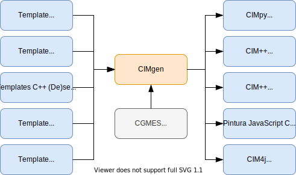

# 

Python tool for code generation from CIM data model for several programming languages

## Concept overview



## Usage example

### Generating C++ files

#### Generating C++ files on Linux

```bash
pip install -e .
cimgen --outdir=output/cpp/CGMES_2.4.15_27JAN2020 --schemadir=cgmes_schema/CGMES_2.4.15_27JAN2020 --langdir=cpp --cgmes_version=cgmes_v2_4_15
```

This will build version `CGMES_2.4.15_27JAN2020` in the subfolder `output/cpp/CGMES_2.4.15_27JAN2020`.

> [!NOTE]
> If you wish to build an alternative version, you can see available options in the subfolder called `cgmes_schema`.
> For the schema `CGMES_3.0.0` you have to use the option
> `--cgmes_version=cgmes_v3_0_0`. `outdir` can be set to whichever absolute path you wish to create the files in.

Alternatively, you can leverage `Makefile`:

```bash
pip install -e .
#unset BUILD_IN_DOCKER # if you previously set to use docker
#export SCHEMA=CGMES_3.0.0 # to use CGMES 3.0.0
make cpp
```

#### Generating C++ files in a Docker container

```bash
docker build --tag cimgen --file Dockerfile .
docker run --volume "$(pwd)/output:/output" cimgen --outdir=/output/cpp/CGMES_2.4.15_27JAN2020 --schemadir=/cimgen/cgmes_schema/CGMES_2.4.15_27JAN2020 --langdir=cpp --cgmes_version=cgmes_v2_4_15
```

alternatively, you can leverage `Makefile`:

```bash
export BUILD_IN_DOCKER=true
#export SCHEMA=CGMES_3.0.0 to use CGMES 3.0.0
make cpp
```

### Generating Python files

#### Generating Python files on Linux

```bash
pip install -e .
cimgen --outdir=output/python/CGMES_2.4.15_27JAN2020 --schemadir=cgmes_schema/CGMES_2.4.15_27JAN2020 --langdir=python --cgmes_version=cgmes_v2_4_15
```

alternatively, you can leverage `Makefile`:

```bash
pip install -e .
#unset BUILD_IN_DOCKER # if you previously set to use docker
#export SCHEMA=CGMES_3.0.0 # to use CGMES 3.0.0
make python
```

#### Generating Python files in a Docker container

```bash
docker build --tag cimgen --file Dockerfile .
docker run --volume "$(pwd)/output:/output" cimgen --outdir=/output/python/CGMES_2.4.15_27JAN2020 --schemadir=/cimgen/cgmes_schema/CGMES_2.4.15_27JAN2020 --langdir=python --cgmes_version=cgmes_v2_4_15
```

alternatively, you can leverage `Makefile`:

```bash
export BUILD_IN_DOCKER=true
#export SCHEMA=CGMES_3.0.0 to use CGMES 3.0.0
make python
```

### Generating Modern Python (i.e. PyDantic based dataclasses) files

#### Generating Modern Python files on Linux

```bash
pip install -e .
cimgen --outdir=output/modernpython/CGMES_2.4.15_27JAN2020 --schemadir=cgmes_schema/CGMES_2.4.15_27JAN2020 --langdir=modernpython --cgmes_version=cgmes_v2_4_15
```

`outdir` can be set to whichever absolute path you wish to create the files in.

alternatively, you can leverage `Makefile`:

```bash
pip install -e .
#unset BUILD_IN_DOCKER # if you previously set to use docker
#export SCHEMA=CGMES_3.0.0 # to use CGMES 3.0.0
make modernpython
```

#### Generating Modern Python files in a Docker container

```bash
docker build --tag cimgen --file Dockerfile .
docker run --volume "$(pwd)/output:/output" cimgen --outdir=/output/modernpython/CGMES_2.4.15_27JAN2020 --schemadir=/cimgen/cgmes_schema/CGMES_2.4.15_27JAN2020 --langdir=modernpython --cgmes_version=cgmes_v2_4_15
```

alternatively, you can leverage `Makefile`:

```bash
export BUILD_IN_DOCKER=true
#export SCHEMA=CGMES_3.0.0 to use CGMES 3.0.0
make modernpython
```

## Development

### Developer Installation

```bash
git clone https://github.com/sogno-platform/cimgen.git
cd cimgen
pip install -e .[dev]
```

Run pre-commit checks manually:

```bash
pre-commit run --all-files
```

Install pre-commit hook to run it automatically:

```bash
pre-commit install
```

## License

This project is released under the terms of the [Apache 2.0 license](./LICENSE).

## Publications

If you are using CIMgen for your research, please cite the following paper in
your publications:

Dinkelbach, J., Razik, L., Mirz, M., Benigni, A., Monti, A.: Template-based
generation of programming language specific code for smart grid modelling
compliant with CIM and CGMES.
J. Eng. 2023, 1-13 (2022). [https://doi.org/10.1049/tje2.12208](https://doi.org/10.1049/tje2.12208)
